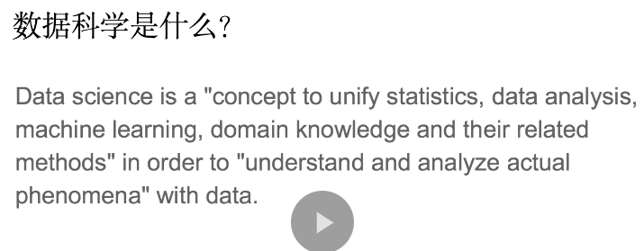
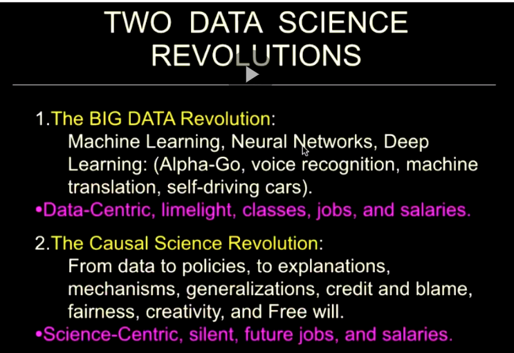
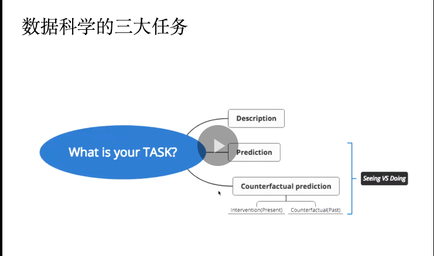
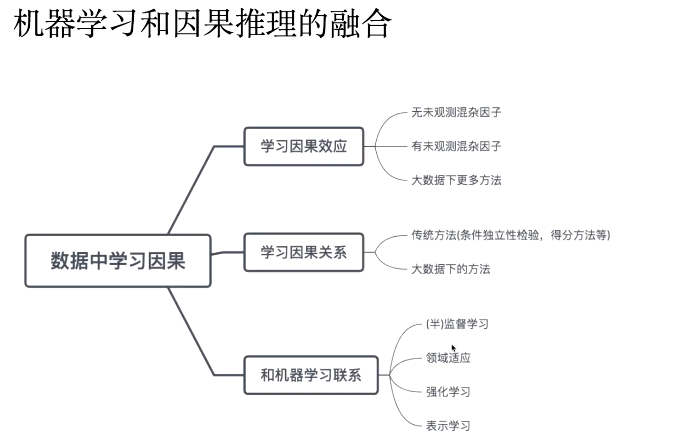
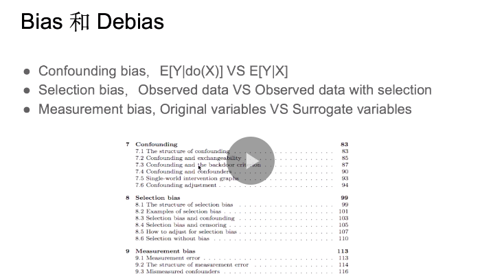

# Notes for Causal Study Group

- [Notes for Causal Study Group](#notes-for-causal-study-group)
  - [1 Modern Causal Framework](#1-modern-causal-framework)
    - [Modern Causal Framework: Concepts](#modern-causal-framework-concepts)
    - [Chapter 1 Reference](#chapter-1-reference)
  - [2 Causal Effect Evaluation and Causal Network Learning](#2-causal-effect-evaluation-and-causal-network-learning)
    - [Chapter 2 Kecy Concepts](#chapter-2-kecy-concepts)
    - [Chapter 2 Reference](#chapter-2-reference)
  - [Chapter 3 SCM (Graphical Model) Introduction](#chapter-3-scm-graphical-model-introduction)
    - [Chapter 3 Key Concepts](#chapter-3-key-concepts)
    - [Chapter 3 Reference](#chapter-3-reference)
  - [Causal Reference Books](#causal-reference-books)

## 1 Modern Causal Framework

> [Speech : Introduction to Modern Causal Framework](https://campus.swarma.org/course/1937)

### Modern Causal Framework: Concepts

- Pearl's Casual Hierarchy (Ladder of Causation)
  - Association vs Causation
  - Intervention vs Counterfactual 
  - Ladders of Models
- Causality (no one true difinion of Casuality)
- Causality and Data Science
  - 
  - 
  - 
- Causality and Machine Learning
  - 
  - 

Homework

1. read 7 tools
2. read PCH paper (in details)

### Chapter 1 Reference

Key Papers

- [1]**Bareinboim, E., Correa, J. D., Ibeling, D., & 'card, T. (2020). On Pearl's hierarchy and the foundations of causal inference. ACM Special Volume in Honor of Judea Pearl (provisional title).**
- [2] **J. Pearl, "The Seven Tools of Causal Inference with Reflections on Machine Learning," Communicatio f ACM, 62(3): 54-60, March 2019**
- [3] **Schalkopf, B. (2019). Causality for Machine learning. arXiv preprint arXiv:1911.10500.**
- [4] A Second Chance to Get Causal Inference Right: A Classification of Data Science Tasks, Miguel A. Hernan, John Hsu &Brian Healy, 2019
- [5] Causal Inference and Data-Fusion in Econometrics, P. Hunermund, E. Bareinboim.Dec, 2019.
- [6] NeurIPS'2019, From System 1 Deep Learning to System 2 Deep Learning, Yoshua Bengio.
- [7] **"The Book of Why: the new science of cause and effect," Judea Pearl and Dana MacKenzie, (Basic Books, 2018).**
- [8] Beyond Curve Fitting: Causation, Counterfactuals, and Imagination-based Al, AAAI Spring Symposium, March 25-27, 2019
- [9] Judea Pearl: Causal Reasoning, Counterfactuals, Bayesian Networks, and the Path to AGI I Al Podcast
- [10] Malinsky, D., Shpitser, I., & Richardson, T. (2019). A potential outcomes calculus for identifying condtional path-specific effects. Proceedings of machine learning research, 89, 3080.
- [11] von KLigelgen, J., Gresele, L., & Scholkopf, B. (2020). Simpson's paradox in Covid-19 case fatality rates: a mediation analysis of age-related causal effects. arXiv preprint arXiv:2005.07180.
- [12] Maathuis, M., Drton, M., Lauritzen, S., & Wainwright, M. (Eds.). (2018). Handbook of graphical models. CRC Press.

Other Reference

- [Judea Pearl -- Data versus Science: Contesting the Soul of Data-Science [CIFAR]](https://www.youtube.com/watch?v=X_1MG4ViVGM)
- [Judea Pearl: From Engineering To Artificial Intelligence](https://www.historyofdatascience.com/judea-pearl-from-engineering-to-artificial-intelligence/)
- John D Collier. Causation is the transfer of information. In Causation and laws of nature, pages 215–245. Springer, 1999

Historical Studies of Causation

- A Treatise of Human Nature (Humean definition of causality)
  - The Scottish philosopher and economist believed that human mind is not equipped with the a priori ability to observe causal relations.
- On the Notion of Cause, Bertrand Russell, 1912
  -  law of causation as usually stated by philosophers is false and is not used in sciences (maybe with exception of their infancy).
- The Natural Philosophy of Cause and Chance, (The Waynflete Lectures), 1949, Max Born
  - In my definition is the postulate that one physical situation depends on the other, and causal research means the discovery of such dependence. This is still true in quantum physics, though the objects of observation for which a dependence is claimed are different: they are the probabilities of elementary events, not those single events themselves.
- Michotte, A. (1963). The perception of causality
  - Michotte claimed that the essence of perceived causality is “ampliation of motion.” The neologism, “ampliation,” refers to two aspects of the perceived motion. First, the motion of the approaching object is transferred to the launched object. Second, for a brief time just after impact (approximately 200ms), the motion is phenomenologically duplicitous: It belongs to the first object while the second object has it. Thereafter, the motion of the second object becomes autonomous
- Joseph Y. Halpern, Actual Causality

## 2 Causal Effect Evaluation and Causal Network Learning

> Speech : Causal From a Mathematical Perspective

### Chapter 2 Kecy Concepts

- Association, Causation and Prediction 
  - learn association : select associated variables
  - learn causality: select / learn confounders
- Confounding 
  - Cox & Wermuth (2003, JRSSB) "compress distribution"
  - Ignorability assumption (cannot be proven wrong)
- Surrogate Index
  - 
  - 
- Network Learning

Homework

1. 阅读[苗旺，刘春辰，耿直（2018）因果推断的统计方法，中国科学-数学 1753-1778.](https://cosx.org/2022/10/causality-statistical-method/) 

### Chapter 2 Reference

Main Reference

- Geng, Z., Liu, Y., Liu, C. C. and Miao, W. (2019) Evaluation of causal effects and local structure learning of causal networks. Ann. Rev. Statist. & Appl. 6, 103-124. 3 
- [苗旺，刘春辰，耿直（2018）因果推断的统计方法，中国科学-数学 1753-1778.](https://cosx.org/2022/10/causality-statistical-method/) 
- Liu, Y., Fang, Z. Y., He, Y. B., Geng, Z. and Liu, C. C. (2021) Local causal network learning for finding pairs of total and direct effects. To appear in J Mach Learn Res.
- [When is correlation transitive?](https://terrytao.wordpress.com/2014/06/05/when-is-correlation-transitive/) 

Other Reference

- Heckman (2008), [Econometric Causality](https://onlinelibrary.wiley.com/doi/abs/10.1111/j.1751-5823.2007.00024.x)
- [Causal Challenge at IEEE World Congress of Computational Intelligence 2008](http://www.causality.inf.ethz.ch/challenge.php)
- [Alan Kay Speech at AI Conference (Curve Fitting)](http://zhishifenzi.com/depth/depth/9658.html)
- [DARPA Big Machanism](https://www.darpa.mil/program/big-mechanism)
- Definition of Causation
  - [Granger Causality](https://en.wikipedia.org/wiki/Granger_causality)
  - [Lewis, David (1973). Causation. Journal of Philosophy 70 (17):556-567](https://philpapers.org/rec/LEWC).
  - [Lewis, David K. (1973). Counterfactuals. Cambridge, MA, USA: Blackwell.](https://philpapers.org/rec/LEWC-2)
  - [Neyman–Rubin causal mode](https://en.wikipedia.org/wiki/Rubin_causal_model)
- Confounding/Confounders
  - [Grayson DA. Confounding confounding. Am J Epidemiol. 1987](https://pubmed.ncbi.nlm.nih.gov/3618585/) 
  - Miettinen OS, Cook EF. [Confounding: essence and detection.](https://pubmed.ncbi.nlm.nih.gov/7304589/)
  - Causality: a Statistical View, D.R. Cox, Nanny Wermuth
  - [Zhi Geng, Jianhua Guo, Wing-Kam Fung（2002）， Criteria for confounders in epidemiological studies](https://rss.onlinelibrary.wiley.com/doi/abs/10.1111/1467-9868.00321)
- Surrogate Index
  - [Fleming & DeMets (1996, Ann Intern Med) ,Surrogate end points in clinical trials: Are we being misled?](https://edisciplinas.usp.br/pluginfile.php/5768115/mod_resource/content/3/1996%20Surrogate%20end%20points%20in%20clinical%20trials.pdf)
  - [Alonso & Molenbergh (2006, Exp Rev Pharm Out Res) , Surrogate end points: hopes and perils](https://www.researchgate.net/profile/Ariel-Alonso/publication/44654218_Surrogate_end_points_Hopes_and_perils/links/02bfe50c8d3af80030000000/Surrogate-end-points-Hopes-and-perils.pdf) 
- [Baker (2006, J Nat Cancer Inst), Surrogate endpoints: wishful thinking or reality](https://academic.oup.com/jnci/article/98/8/502/2522082) 
- [Surrogate endpoints in clinical trials: Definition and operational criteria, Ross L. Prentice](https://onlinelibrary.wiley.com/doi/10.1002/sim.4780080407)
- [Deadly Medicine: Why Tens Of Thousands Of Patients Died In America’s Worst Drug Disaster. Thomas J. Moore, Simon & Shuster, ](https://www.amazon.com/Deadly-Medicine-Thousands-Patients-Americas/dp/0684804174)
- Frangakis, Constantine E, and Donald B Rubin. 2002., “Principal stratification in causal inference.” Biometrics, 58(1): 21–2
- Lauritzen, Steffen L. 2004. “Discussion on causality.” Scandinavian Journal of Statistics, 31(2): 189– 193.
- [Xie & Geng, 2008, Structural learning of chain graphs via decomposition.](https://www.jmlr.org/papers/volume9/ma08a/ma08a.pdf)

## Chapter 3 SCM (Graphical Model) Introduction

> [Part I Speech](https://pattern.swarma.org/study_group_issue/6)
> [Part II Speech](https://pattern.swarma.org/study_group_issue/343)
> [Part III Speech](https://pattern.swarma.org/study_group_issue/343)

### Chapter 3 Key Concepts

- Paradox
  - [Monty Hall Paradox](https://en.wikipedia.org/wiki/Monty_Hall_problem)
  - [Bertrand Paradox](https://en.wikipedia.org/wiki/Bertrand_paradox_(probability))
  - [Berkson's Paradox](https://en.wikipedia.org/wiki/Berkson%27s_paradox)
- Causal Diagram
  - Chain
    - Mediator
  - Fork
    - Confounder
  - Collider
    - Collider
- [d-separation](http://bayes.cs.ucla.edu/BOOK-2K/d-sep.html)
- Association vs Causation
- 3 Symbols systems
  - do-calculus
    - do operator to indicate "intervention"
    - calculate distributions to distributions
  - Rigime Indicator (Regime could be a specific value or dynamic indicators)
    - Association vs Causation $p(y|\tilde{x}; \sigma = \empty ) \neq p(y; \sigma = \tilde{x}) $
  - Potential Outcome
    - $Y(\tilde{x})$ is the "Potential Outcome"
    - $Y(\tilde{x}) \neq p(y|\tilde{x})$
    - Can represent Individual Treatment Effect (ITE), Average Treatment Effect (ATE), Heterogenous Treatment Effect (HTE)
- Graphical Models
  - Pa (parent nodes)
  - Ch (childern nodes)
  - De (desendents)
  - Nd (non-parent nodes)
  - $$p(x) = \prod_{k \in V} p(x_k|x_{pa(k)}) \leftarrow x_k \perp x_{nd(k)\\pa(k)} | x_{pa(k)}$$
- DAG
  - Intervention DAG
  - Causal GAG

Homework

1. 面试整理，画Monty hall, bertrand, berkson's paradox
2. Read "Good Control & Bad Control"
3. Read Blog (Formalized Thinking)
4. Read Handbook (Chapter 15, Causal DAG vs Graphical DAG)

### Chapter 3 Reference

- [Formalised Thinking(Blog), Causality and graphical methods](https://formalisedthinking.wordpress.com/2010/08/20/pearls-formalisation-of-causality-sequence-index/)
- [Handbook of Graphical Models](https://stat.ethz.ch/~mmarloes/papers/Handbook.pdf)
- [If correlation doesn’t imply causation, then what does? by Michael Nielson](https://michaelnielsen.org/ddi/if-correlation-doesnt-imply-causation-then-what-does/)

## Causal Reference Books

- "The Book of Why: the new science of cause and effect," Judea Pearl and Dana MacKenzie, (Basic Books, 2018).